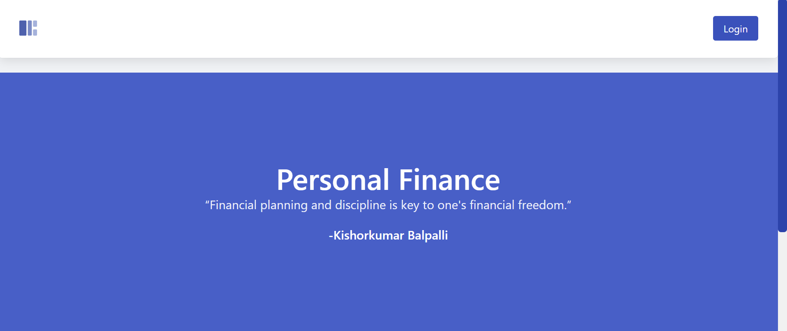
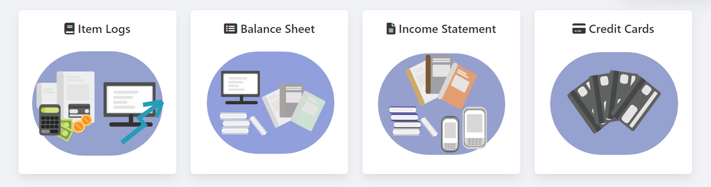
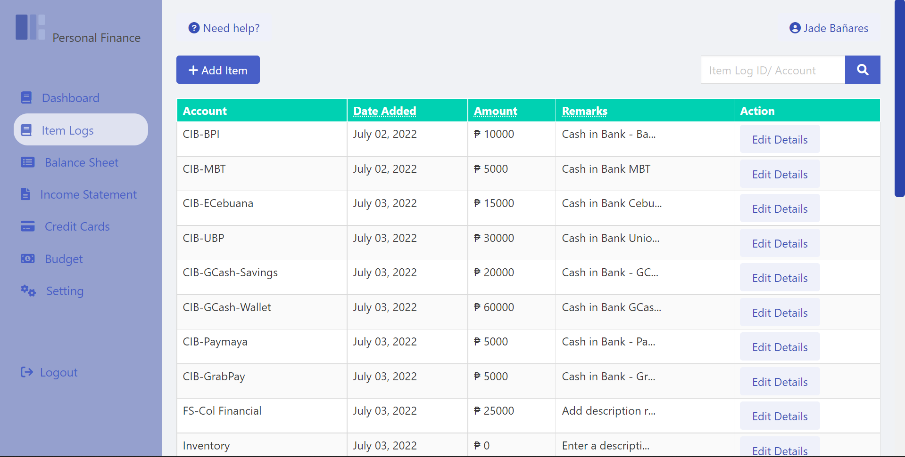
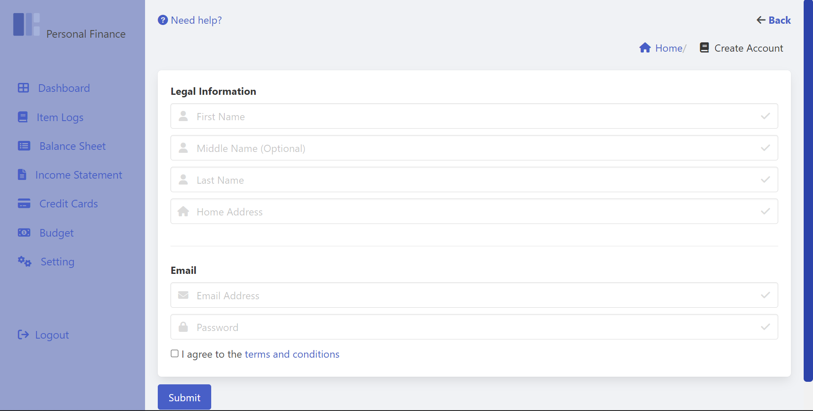

# Personal Finance

## Table of contents

- [Overview](#overview)
  - [The Objectives](#the-objectives)
  - [Screenshot](#screenshot)
- [My process](#my-process)
  - [Built with](#built-with)
  - [Continued development](#continued-development)
  - [Useful resources](#useful-resources)
- [Author](#author)

## Overview

### The Objectives

Should be able to:

- Create a web pages for Item Logs, Balance Sheet, Income Statement and Credit Card
- See hover states for all interactive elements on the page
- Create a graph that shows the table data
- Create a registration and login
- Others...

### Screenshot

## The process

### Built with

- HTML5 markup
- CSS custom properties
- Flexbox
- Bulma
- Adobe Illustrator (For Visual Representation)
- JavaScript
- PHP

### Continued development

Working in progess. Target objective is to enhance UX/UI experience by simply customizing each design using Adobe Illustrator. Furthermore, to add functionality of each modules.

### Useful resources

- [Bulma](https://bulma.io/) - Built in CSS Framework
- [YouTube](https://www.youtube.com) - Great tool to expand the knowledge. There's a lot of free resources. Outhere
- [Stacksoverflow](https://stackoverflow.com/) - Great tool for debugging by simply asking for a help especially for Backend programming. 

## Collaborators/ Programmers

- Israel Bañares
